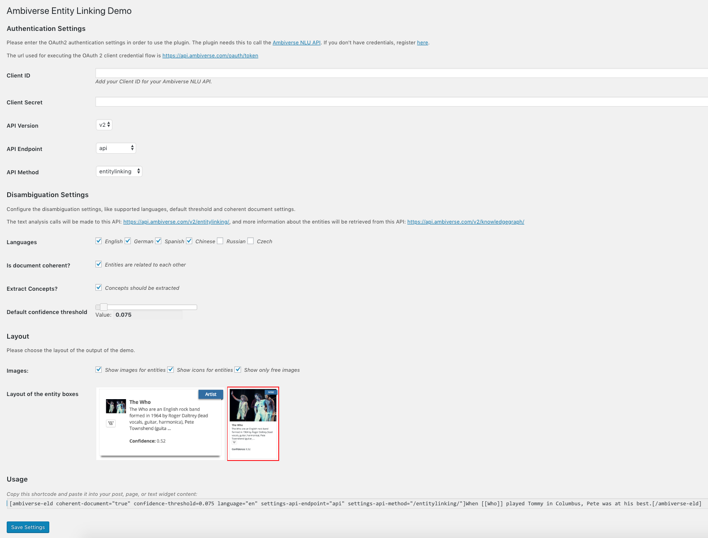

# AmbiverseNLU Demo

AmbiverseNLU Demo WordPress plugin fro the demo on [https://ambiversenlu.mpi-inf.mpg.de](https://ambiversenlu.mpi-inf.mpg.de). 

For the example sentence below:

```
Jack founded Alibaba with investments from SoftBank and Goldman.
```

The AmbiverseNLU Demo will produce the following outputs:

[](http://ambiversenlu.mpi-inf.mpg.de)

## Installing

To install the demo on a WordPress instance, you need to package the code in a `.zip`, and `Add` and `Activate` the plugin.

## Configuration

To be able to use the demo, you need to configure it to consume the [AmbiverseNLU](https://github.com/ambiverse-nlu/ambiverse-nlu) Web Service.
This code uses the public Web Service API running on [https://api.ambiverse.com](https://api.ambiverse.com). 
To do the configuration, go to, `Settings`->`Ambiverse Entity Linking Demo`. The screenshot below shows an example configuration.



## Usage

To use the demo in a WordPress page or post you add the short code displayed in the configuration page. For example, you can add this.

~~~~~
[ambiverse-eld coherent-document="true" confidence-threshold=0.075 language="en" settings-api-endpoint="api" settings-api-method="/entitylinking/"]When [[Who]] played Tommy in Columbus, Pete was at his best.[/ambiverse-eld
~~~~~